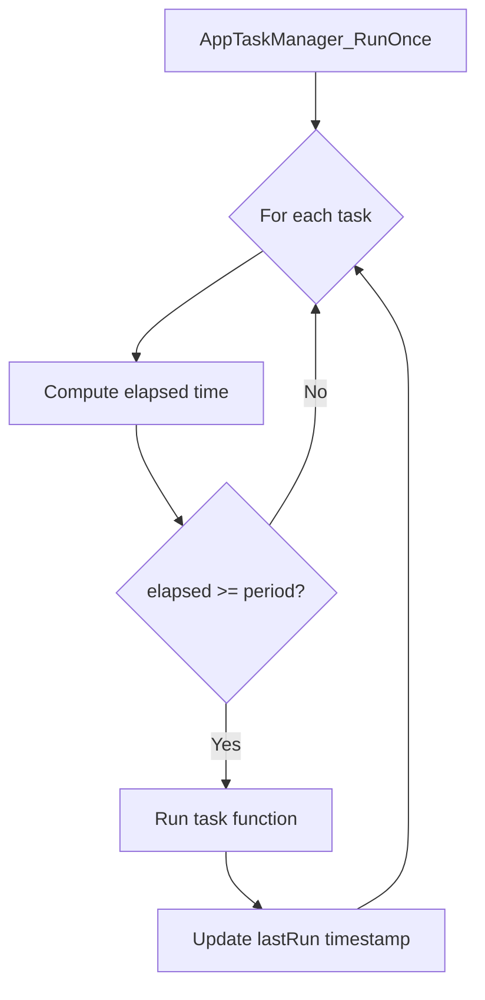
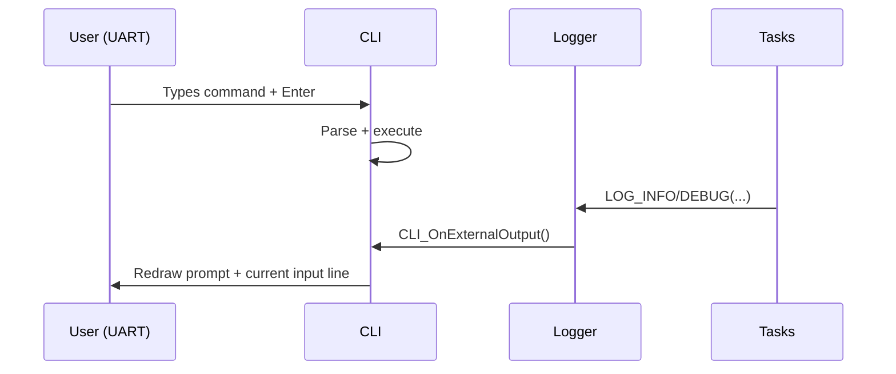

# Code Flow

This document shows the high-level runtime flow of the firmware from reset to steady-state operation.

## Startup → Main Loop

```mermaid
flowchart TD
    R[Reset / Power-on] --> S[Startup + Vector Table]
    S --> H[HAL_Init + SystemClock_Config]
    H --> M[main.c]
    M --> I[App_MainInit]
    I --> L[Log_Init]
    I --> C[CLI_Init]
    I --> P[PowerManager_Init]
    I --> SI[Sensor Backends Init]
    I --> T[AppTaskManager_Init + Register Tasks]
    T --> LOOP{{while(1)}}
    LOOP --> RUN[AppTaskManager_RunOnce]
    RUN --> LOOP
```

## Cooperative Scheduling (RunOnce)



## CLI + Logging Interaction


